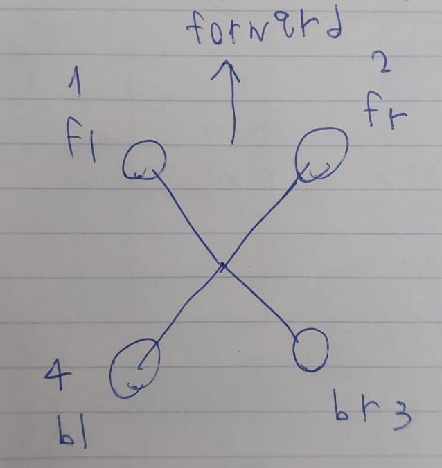

# Simple-Drone-Simulator
 A simple drone simulator, writen in Cpp

## Introduction
This repo is responsible for:
* producing a drone dynamics simulation based on command line input from a user.

## Example

## Libraries
We used the following libraries with **vcpkg**:
* cpputest
* armadillo
* sciplot
## Docomentation
Click [here](https://vyohai.github.io/Simple-Drone-Simulator/html/index.html) to go to The documantation.
	
## Drone configuration
<html>
<body>
	
<figure>
  
  <figcaption>Fig.1 - the drone configuration and rottors numbering.</figcaption>
</figure>
	
<html>
<body>

**you could change the drone Mass/Inertia/Size and other parmaters with /src/config.hpp header file**

